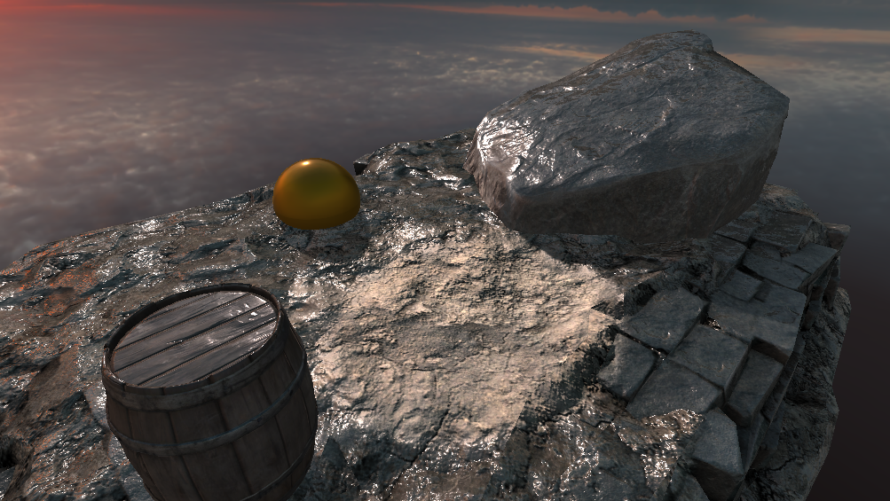

# 1. Dry Decals

> This demo is located at `"Assets/PlaceholderSoftware/WetSurfaceDecals/Demos/7. Dry Decals"`

This scene demonstrates a large puddle of water with a dry spot cut out of the middle. A `Wet Decal` component on the `Wet` game object has been stretched over the entire scene to make everything wet. There is another `Wet Decal` component on the `Dry` game object in the middle of the scene - this decal is set to `Dry` mode so it is removing wetness from the scene.

The dry decal has all of the same settings as a wet decal. For each pixel a wet decal generates a number between `0` and `1` to indicate how wet that pixel is. A dry decal generates numbers between `0` and `1` in exactly the same way but the number is multiplied with the wetness value for that pixel, drying it out.

### Adjustments

Try adjusting the following and observing how the scene changes:

 - Adjust the size, shape and position of the dry decal, notice how it projects dryness onto different surfaces in the same way as a wet decal.

 - Rotate the dry decal 90 degrees, notice how the ground is now completely wet as if the dry decal is doing nothing - this is because the decal is no longer aligned with the ground. Try changing the `Layer Mode` to triplanar, you can now configure each axis of dryness independently.

 - Disable the wet decal, notice how the dry decal has no effect on surfaces which are not affected by a wet decal.