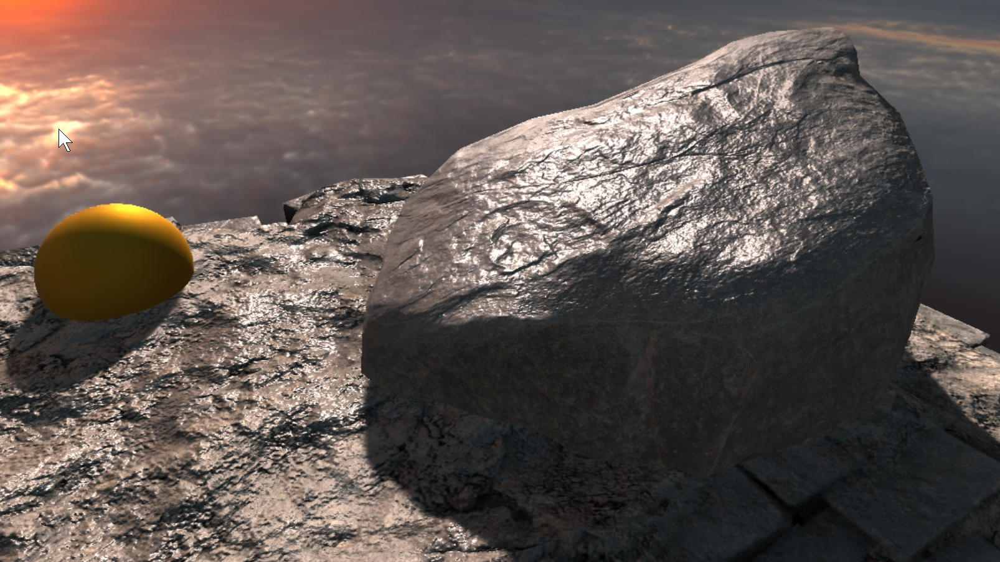

# 2. Drying With Timeline

> This demo is located at `"Assets/PlaceholderSoftware/WetStuff/Demos/2. Timeline"`

This scene demonstrates how to use timline to slowly dry out a puddle of water. The basic setup is the same as [scene 1](../Puddle).

Open the timeline window and select the `Puddle` object, you will see a single timeline track with a `PlaceholderSoftware.WetStuff.Timeline.Settings` track which contains 2 clips.

The first clip contains the same settings as the static puddle in demo scene one. The second clip slightly increases the softness and reduces the threshold to zero. This causes ther puddle to shrink inwards to nothing over the duration of the fade.

### Adjustments

Try adjusting the following and observing how the scene changes:

 - Modify the two clips to contain the same settings and just fade the saturation from 1 to zero. This does _not_ create a good looking drying effect.

 - Try fading the red (small puddles) and alpha channels (large puddles) at different rates.