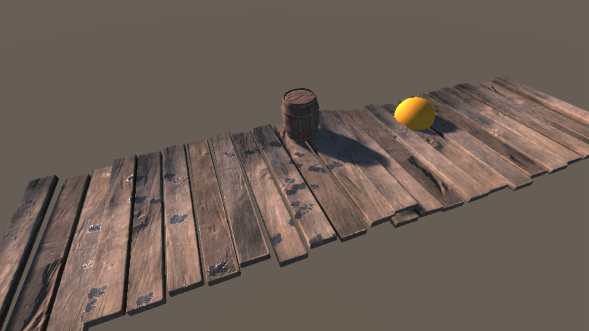

# 3. Short Lived Particle Splatters

> This demo is located at `"Assets/PlaceholderSoftware/WetSurfaceDecals/Demos/4. Particles (Splat)"`

This scene demonstrates a single fast particle splatter.

The `Particle System` object contains a Particle System component which emits a burst of particles after a few seconds, these particles have collisions enabled and collide with a plane which intersects the wooden floor. There is also a `Particle Wet Splatter` component on this object. It has the 4 features enabled:

 - _Decal Count Limit_ is set to the same number as the amount of particles which will be emitted. The Decal chance is set to a flat line so every particle impact will generate a decal.

 - _Randomize Size_ is enabled, this will slightly change the size of each decal (between 0.75x and 1.25x).

 - _Randomize Orientation_ is enabled, this will slightly rotate each decal left or right by a small amount. The rotation will be applied _after_ the decal has been aligned with the impact velocity, so it will rotate around that alignment.

 - _Impact Velocity_ will align each decal with the direction of the impact, stretch it along the impact direction according to the _Scale_ curve and will offset it from the impact point along the impact direction according to the _Offset_ curve.

There are also 4 `Particle Wet Splatter Template` components. Each of these defines a decal and a probability. When a new decal is created by the splatter system it will randomly select one of these templates according to the probability values on the templates. In this case all the templates have a weight of `1` so they are all equally likely.

### Adjustments

Try adjusting the following and observing how the scene changes:

 - Increase/decrease the particle speed. Notice how the decals become more stretched as the particle impacts faster.

 - Change the angle of the particle emitter. Notice how particle hitting straight into the surface are scaled but aren't stretched much, wheras particle which hit the surface at a narrow angle are stretched more.

 - Try increasing the number of particles emitted, notice how the particles which hit the floor layer no longer generate a decal because the limit was hit by the earlier decals. Try lowering the `Decal Chance` so there are still some decals left by the time the later particles impact.