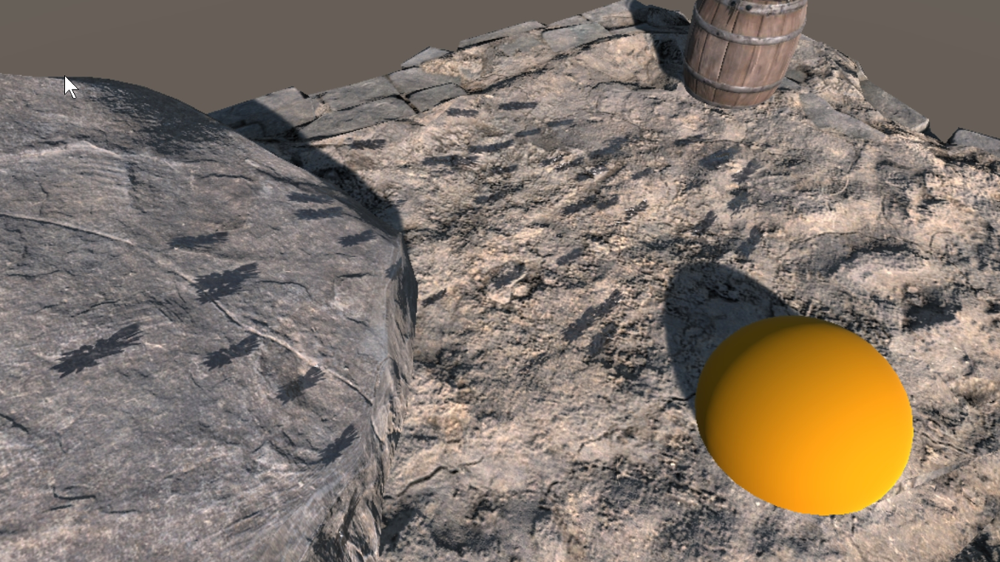

# 3. Short Lived Particle Splatters

> This demo is located at `"Assets/PlaceholderSoftware/WetSurfaceDecals/Demos/4. Particles (Splat)"`

This scene demonstrates a single fast particle splatter. There is a fixed number of decals which can be created and decals do not have any kind of lifetime, once placed they are permanent.

The `Particle System` object contains a Particle System component which emits a burst of particles after a few seconds, these particles have collisions enabled (Under `Collision > Send Collision Messages`). There is also a `Particle Wet Splatter` component on this object. It has the 4 features enabled:

### Decal Count Limit

This controls how many decals can be created. It is set to 45 which is the same number of particles which will be emitted in the burst. The `Decal Chance` curve controls how the chance of a decal being spawned changes as the number of decals increases this can be used to prevent a hard cutoff as the decal limit is hit. In this case it is set to a flat line because there are exactly enough decals.

### Randomize Size

This changes the size of each individual decal. For each decal created the `Decal Size` set in the core settings will be multiplied by a random value between min and max to choose the size. A small amount of randomization creates a much more natural look to splatters.

### Randomize Orientation

This rotates each decal a random amount left or right around it's Y axis. The Y-Axis of each decal is set to the _normal_ of the collision event, so it points up out of the surface the decal is placed on.

### Impact Velocity

This aligns the decal will the velocity of the particle at the point of impact. The randomization applied by `Randomize Orientation` is applied after the decal has been aligned - so each particle will be within 14 degrees (7 degrees, left or right) of the impact velocity of the particle which created it.

The `Scale` curve controls how the particle is stretched along the direction of impact according to the impact velocity. In this case the decals will be stretched 1x (i.e. no stretch) if the impact velocity is zero and 3x if the impact velocity is one or greater.

The `Offset` curve controls how the particle is offset from the impact points along the direction of impact according to the impact velocity. In this case the decals will be moved up to `0.2` when the impact velocity is `1`.

## Particle Wet Splatter Template

There are 4 of these components attached to the object. Each one defines a decal and a probability. When a new decal is created by the splatter system it will randomly select one of these templates according to the probability values on the templates. In this case all the templates have a weight of `1` so they are all equally likely.

### Adjustments

Try adjusting the following and observing how the scene changes:

 - Increase/decrease the particle speed. Notice how the decals become more stretched as the particle impacts faster.

 - Change the angle of the particle emitter. Notice how particle hitting straight into the surface are scaled but aren't stretched much, wheras particle which hit the surface at a narrow angle are stretched more.

 - Try increasing the number of particles emitted, notice how the particles which hit the floor layer no longer generate a decal because the limit was hit by the earlier decals. Try lowering the `Decal Chance` so there are still some decals left by the time the later particles impact.