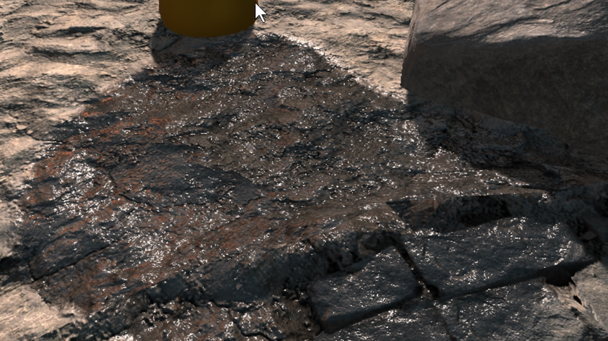

# 1. Puddle

> This demo is located at `"Assets/PlaceholderSoftware/WetSurfaceDecals/Demos/1. Puddle"`

This scene demonstrates a very basic puddle of water. A `Wet Decal` component has been configured to have a single detail layer. The layer mask for the detail layer has been set to "rgba-freq-range", this texture contains 4 frequencies of noise, high frequency in red through to low frequency in alpha.

The red channel (high frequency perlin noise) is enabled with a low threshold and low softness - this produces a few small patches of wet. The alpha channel (low frequency perlin noise) is enabled with a higher threshold and softness - this produces a single large puddle.

### Adjustments

Try adjusting the following and observing how the scene changes:

 - There is a directional light in the scene, it is creating the specular highlights on the puddle. Try rotating it around and observing how the highlights change.

 - Now try moving the camera and observing how the highlights change. Specular highlights depend on the angle between the camera and the light.

 - Try changing the skybox to a different texture (e.g. `Default-Skybox`), notice that the apparent colour of the puddle changes to reflect the skybox colour.

 - Because the puddle is only using a single detail layer (projected down) the top of the barrel is wet but the side of the barrel is dry. Try changing the `Layer Mode` to `Triplanar` and configuring the two extra detail layers to make the side of the barrel look wet.

 - If you have the Unity [post processing stack](https://docs.unity3d.com/Manual/PostProcessing-Stack.html) installed trying attaching a `Post-Processing Behaviour` to the camera and enabling screen space reflections. The water surface will reflect the environment.