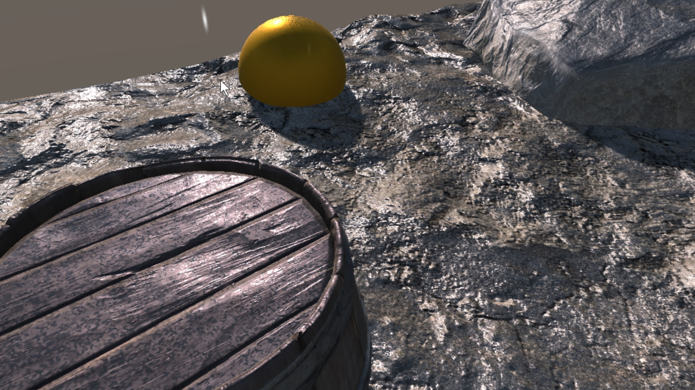

# 3. Rain With Timeline

> This demo is located at `"Assets/PlaceholderSoftware/WetSurfaceDecals/Demos/3. Rain"`

This scene demonstrates how to create a rain effect using timeline. This scene contains 2 decals.

`Rain` is a rain drop effect, it simulates individual drops hitting the ground and creating tiny puddles. This is done by using the `rgba-noise-white` texture which contains white noise in all channels. As the threshold is increased many tiny spots appear. To simulate heavier rain you should increase the speed at which the threshold increases or use more channels (using two channels is equivalent to doubling the speed in one channel). The mode of the red channel is set to `Advanced Range Remap`, this means that limits can be set on the maximum and minimum wetness values generated. In this case the maximum wetness value has been adjusted down slightly (just below the level of a puddle), to simulate the ground being damp instead of puddles forming.

`Puddle` is a simple puddle. It is faded in once there are a lot of rain drops on the ground.

### Adjustments

Try adjusting the following and observing how the scene changes:

 - Increase the threshold faster/slower to create heavier/lighter rain.

 - Use two channels with different softness to introduce some more variation into the effect.

 - Try fading in the secondary puddle sooner/later/faster/slower.

 - Try adjusting the softness of the raindrops over time to simulate them spreading out and forming larger puddles.

 - Try using different types of noise. For example blue noise will distribute the raindrops more evenly (which is less realistic, but may be more pleasing to the eye).