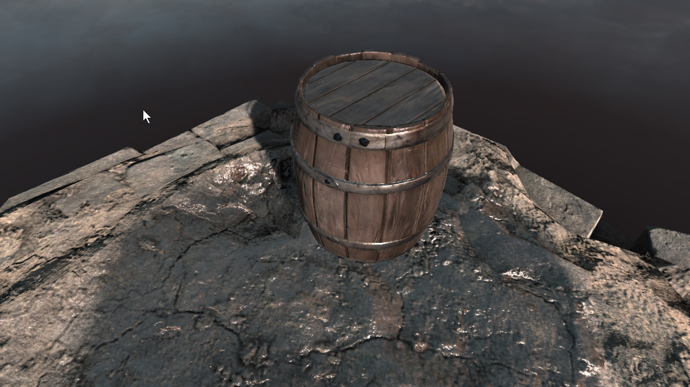

# 6. Triplanar Mode

> This demo is located at `"Assets/PlaceholderSoftware/WetSurfaceDecals/Demos/6. Triplanar Mapping"`

This scene demonstrates how to use triplanar mapping mode to project different details onto different faces depending upon their direction.

`Puddle` is set to `Triplanar` mode, this means that there are three detail layers available. The `X Detail Layer` projects along the +X and -X axes (left and right), `Y Detail Layer` along +Y and -Y (up and down) and `Z Detail Layer` along +Z and -Z (forward and backward).

All channels in the X layer are completely disabled, this causes the front and back of the barrel (from the point of view of the above image to be dry). The Y layer has a circular layer mask, so the top and bottom surfaces are wet. The Z detail layer has the layer mask set to white noise (rgba-white-noise texture), with the threshold set to maximum so it is all wet.

### Adjustments

Try adjusting the following and observing how the scene changes:

 - Change the `Face Sharpness` mode. This controls how sharp the transition is from one direction to the next. 

 - Change the `Z Detail Layer` threshold, note how only surfaces facing in the +Z or -Z directions are affected.

 - Enable a channel in the `X Detail Layer`.