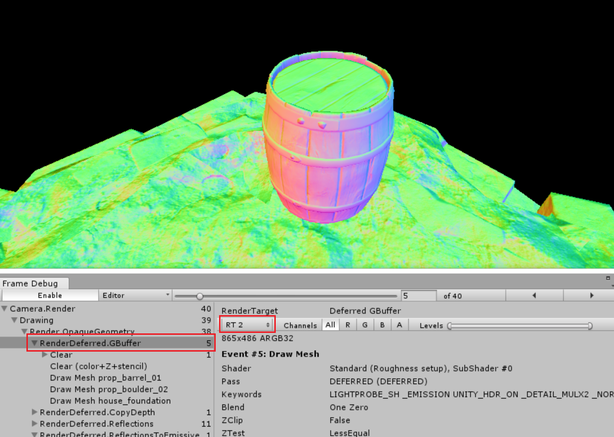

## What Items In the Scene Are Visible?

Wet Stuff works by modifying the internals of the Unity renderer to make dry materials appear wet. You can easily verify if a particular item will be affected by Wet Stuff with the _Frame Debugger_.

1. Open the frame Debugger through `Window > Frame Debugger` or `Window > Analysis > Frame Debugger`
2. Select the `RenderDeferred.GBuffer` entry.
3. Change the dropdown box to `RT2`. You should see something like this:

If you can see your object here then it will be visible to Wet Stuff and will be modified by the wetness effect.

For example the image above shows the barrel and the ground and so you know that they will both be modified by Wet Stuff. However it does not show the skybox so you know that it will not not be modified by Wet Stuff.

## HDRP Support

It is not currently possible to support the HDRP. We are waiting for extra some features to be added by Unity which will make it possible (an equivalent to the `https://docs.unity3d.com/ScriptReference/Camera.AddCommandBuffer.html` method).

## LWRP Support

LWRP is not a deferred renderer and is thus incompatible with how Wet Stuff works. It will never be supported.

## VR Support

Wet Stuff currently works with VR if you are **not** using [Single Pass Stereo rendering](https://docs.unity3d.com/Manual/SinglePassStereoRendering.html) (SPSR). We have experimental support for SPSR which we expect to release soon, [contact us](mailto://admin@placeholder-software.co.uk) if you are interested in helping to test this out.