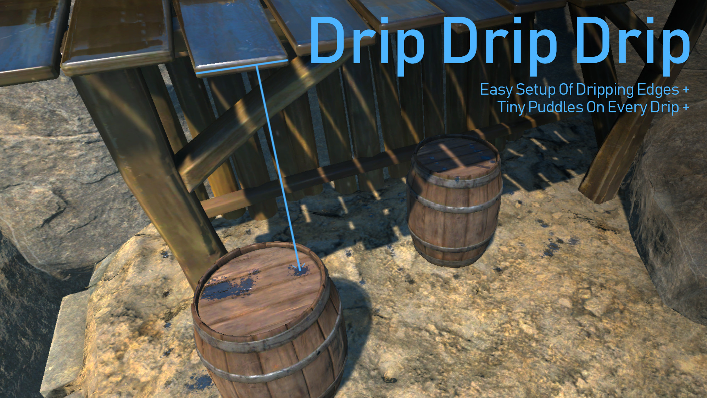
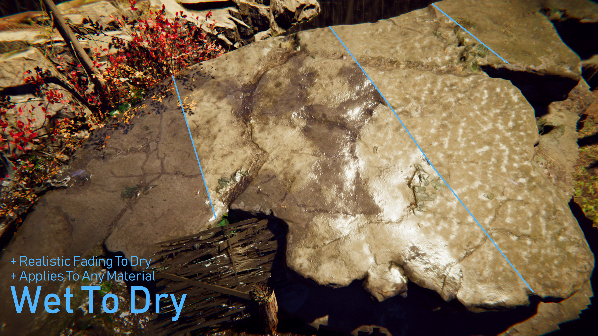

Wet Stuff has several components which make it easy to integrate puddles with any dynamic weather system. It's easy to extend these components to support any weather system.

We have integrated Wet Stuff with [Enviro](https://assetstore.unity.com/packages/tools/particles-effects/enviro-sky-and-weather-33963?aid=1100lJDF) and [Unistorm](https://assetstore.unity.com/packages/tools/particles-effects/unistorm-dynamic-modular-weather-2714?aid=1100lJDF), both of these are available for free on the asset store; [Wet Stuff For Enviro](https://assetstore.unity.com/packages/tools/particles-effects/wet-stuff-for-enviro-133615?aid=1100lJDF), [Wet Stuff For Unistorm](https://assetstore.unity.com/packages/slug/139760?aid=1100lJDF). **To use these packages you must have purchased and installed both Wet Stuff and the Weather asset installed first.**

# Getting Started

## 1. Wetness Source

Add a Wetness source component anywhere into your scene. This will be included in the weather integration package you are using (e.g. Enviro or Unistorm). For example for Enviro it is located in `Assets/PlaceholderSoftware/WetStuff/Integrations/Enviro/EnviroWetness.cs`.

This component extracts data about the current weather from the weather system you are using, the other components use this data to automatically drive their behaviour in response to changes in the weather.

## 2. Drip Line

The [Drip Line](../../Reference/DripLine) component is located in `Assets/Plugins/PlaceholderSoftware/WetStuff/Weather/DripLine.cs` and can be used to simulate dripping rooflines. This component automatically configures a particle emitter to slowly drip water from a line and automatically sets up [wet particle splatters](../WetParticleSplatter) where the particles hit the floor. The rate of dripping is automatically controlled by the weather integration.

## 3. Auto Rain Puddle

The [Auto Rain Puddle](../../Reference/AutoRainPuddle) component is located in `Assets/Plugins/PlaceholderSoftware/WetStuff/Weather/AutoRainPuddle.cs` and can be used to simulate puddles which grow and shrink with the weather. This component automatically animates wet decals to act like puddles in response to the weather integration.