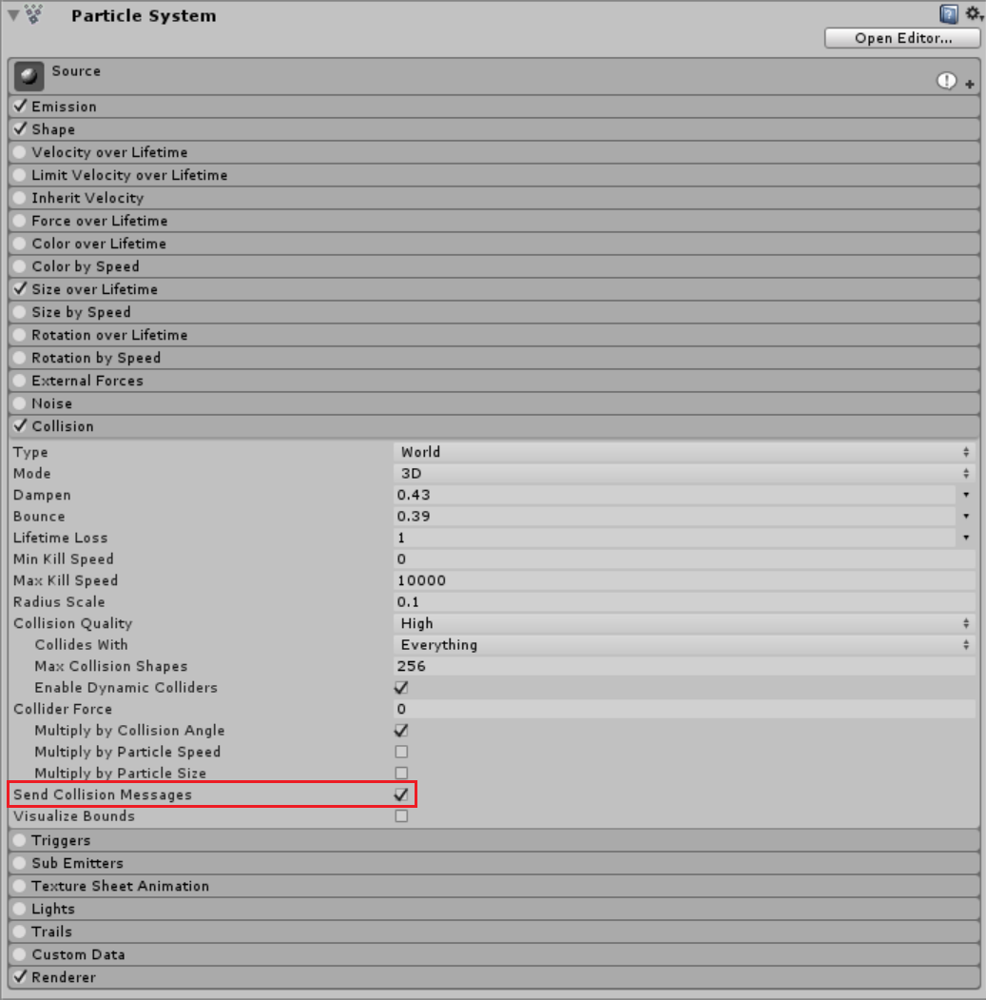
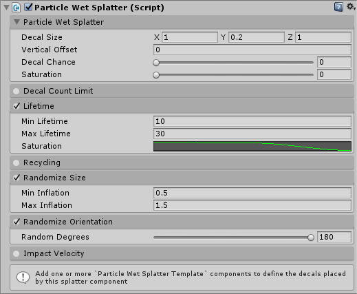
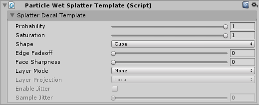
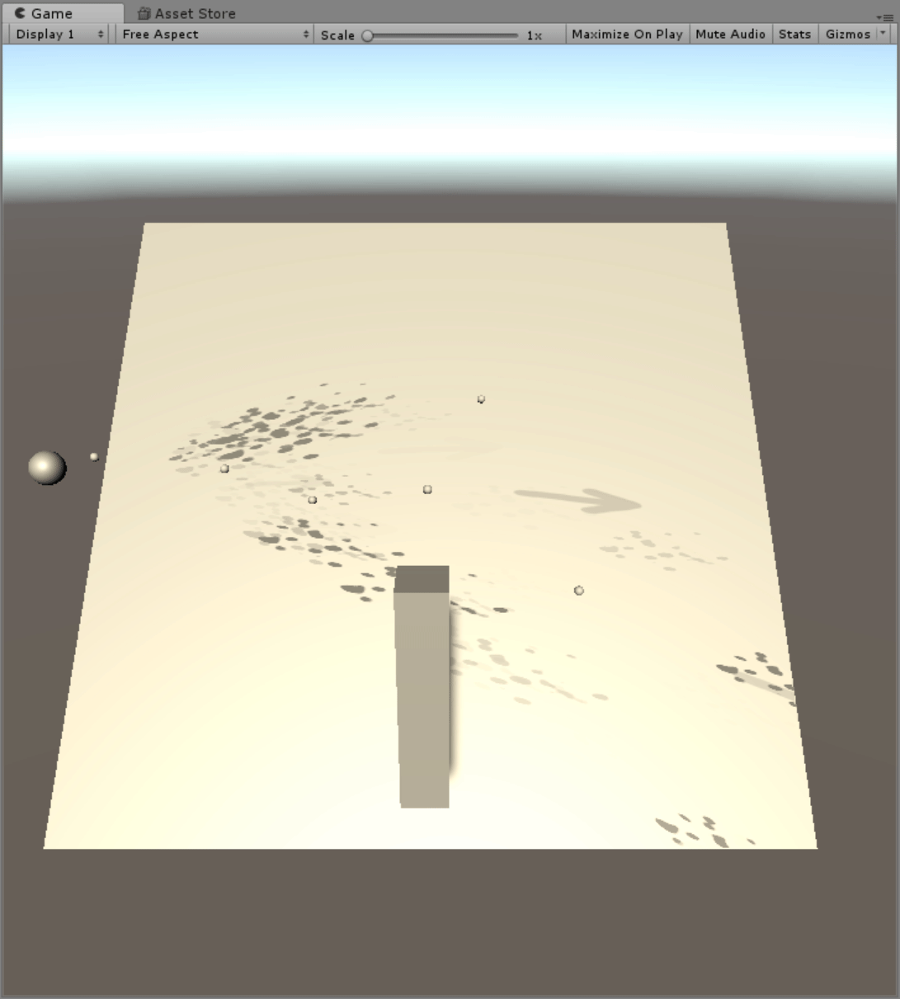

The `WetParticleSplatter` component can be added to any game object that also contains a Shuriken particle system. Wet decals with be automatically placed wherever a particle collides with geometry. This can be used to create dynamic effects such as water pistols or leaking pipes.

> Collisions must be enabled on the particle system, and any geometry that you wish to be hit by particles must have a Collider.

## Example Setup

1. Add a `Particle Wet Splatter` component to a Shuriken particle system. Enable "Collosion" and "Send Collision Messages".

2. In the `Particle Wet Splatter` configuration:
   - Enable "Lifetime" and set the "Min Lifetime" to 10 and "Max Lifetime" to 30. This will give decals spawned from collisions a random lifetime between 10 and 30 seconds. Decals will gradually fade off over the lifetime.
   - Enable "Randomize Size", and set "Min Inflation" to 0.5 and "Max Inflation" to 1.5. This will cause decals to vary in size as they spawn.
   - Enable "Randomize Orientation" and set "Random Degrees" to 180. This will cause decals to spawn with a random rotation applied.

3. Add a new `Particle Wet Splatter Template` component. You can have multiple templates - when a particle collides with a surface and a new splatter is created one of the templates will be used. Set "Probability" to 1, This controls how likely this template is to be selected. Set "Saturation" to 1.

When you run the game you will see particles being created whenever a particle collides with an object.

Here is an example of a more complex system using two different templates (an arrow and a splash). The "impact velocity" feature is enabled, so the decals are aligned with the impact direction and scaled slightly according to how fast the impact was:

Make sure to check out the [Particle Wet Splatter](/Reference/ParticleWetSplatter) and [Particle Wet Splatter Template](/Reference/ParticleWetSplatterTemplate) reference docs for full details on all the features.

## A Note On Collision Geometry

The Wet Splatter decals are created where the particle impacts collision geometry. However, collision geometry often does not conform exactly to the graphical mesh which it surrounds, it is usually slightly larger. If the collision geometry is sufficiently inflated this can cause all of the splatters to be invisible because they are not intersecting the graphical geometry. To fix this the `Particle Wet Splatter` component has a `Vertical Offset` setting which offsets all decals along the collision normal vector by a fixed amount. You should set it to the inverse of the inflation used on your collision meshes.