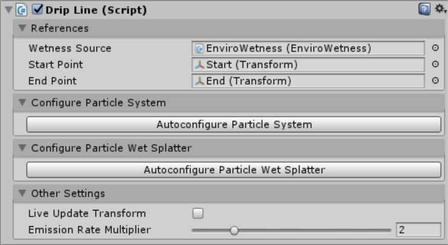

# Drip Line Reference

This component creates a particle system between two points and automatically configures it to act like a drippling roofline. Wet decal splatters are created where the drips hit the ground. The rate of dripping is controlled by a weather system through a [Wetness Source](/References/BaseExternalWetnessSource) component.

## Inspector

### References

This section contains references to other game objects in the scene. The other sections are locked until all the references are correctly set up.

#### Wetness Source

A reference to a [Wetness Source](/References/BaseExternalWetnessSource) component.

#### Start Point

A reference to a transform which defines the start of the line.

#### End Point

A reference to a transform which defines the end of the line.

### Configure Particle System

Clicking the `Autoconfigure Particle System` button will find a sibling `Particle System` component and will overwrite *all of the settings* with the settings necessary for the drip line effect.

### Configure Particle Wet Splatter

Clicking the `Autoconfigure Particle Wet Splatter` button will find a sibling [Particle Wet Splatter](/References/ParticleWetSplatter) component and will overwrite *all of the settings* with the necessary settings for the drip line effect.

### Other Settings

#### Live Update Transform

If this box is ticked the position and length of the line will be updated every frame. This should be used if the `Start Point` and `End Point` transforms will move in play mode.

#### Emission Rate Multiplier

The drip line spawns particles in response to the weather, this setting changes the rate at which particles are emitted.