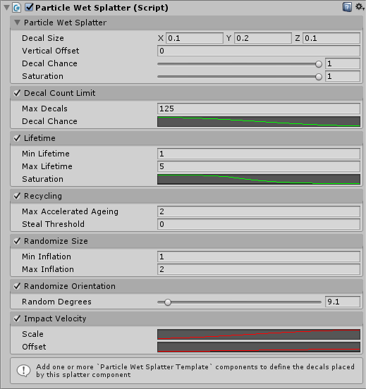

# Particle Wet Splatter Reference

This component automatically creates decals at particle collision points.

## Inspector

## Particle Wet Splatter

This section contains the core settings for the splatter component.

### Decal Size

The base size of the decals created by this component. It may be modified by other sections (e.g. `Randomize Size`).

### Vertical Offset

How far to offset the decal away from the collision point. Use negative values to move the decal further into the collision points. If the surface is bumpy it is advisable to use a small negative offset to ensure that decals completely cover the surface at the impact point.

### Decal Chance

The probability that a particle impact event will generate a decal.

### Saturation

The base saturation of the decals created by this component. It will be modified by the saturation of the template to calculate the final saturation for the new decal. It may be modified by other sections (e.g. `Lifetime > Saturation`).

## Decal Count Limit

An optional part of the component which, if enabled, ensures that no more than a certain number of decals are created.

### Max Decals

The maximum number of decals this component may create.

### Decals Chance

Modifies the `Decal Chance` setting according to a curve as the number of decals approaches the decal limit.

## Lifetime

An optional part of the component which, if enabled, fades out decal saturation over a set lifetime.

### Min/Max Lifetime

The lifetime of each new decal will be a value between these two values.

### Saturation

A curve which defines how the saturation of a decal changes over it's lifetime. The X-Axis should be from `0` to `1`.

## Recycling

An optional component which, if enabled, re-uses previously used decals to create new ones. Requires `Decal Count Limit` to be enabled.

### Max Accelerated Ageing

When a particle impact occurs and a the effect attempts to generate a new decal but fails because the decal count limit has been reached it will select a random decal and accelerate it's ageing by a random amount up to this value. This makes it slightly more likely that a decal will have timed out (and be available for re-use) next time an impact occurs.

### Steal Threshold

When a particle impact occurs and a the effect attempts to generate a new decal but fails because the decal count limit has been reached it will attempt to find a decal below this threshold, if it finds one it will immediately kill it and use it to create a new decal for the new impact. This can cause a visual "pop" as the old decal immediately disappears without fading.

The value used for the threshold is an approximation of the amount of "pop" which will happen due to immediately killing this decal:

 > `Decal Area * Decal Saturation`

So small decals which are almost dry (i.e. hard to see) will preferantially be stolen.

## Randomize Size

An optional component which, if enabled, randomly inflates each new decal by some amount.

### Min/Max Inflation

A random value between these two values will be chosen for each new decal. The `Decal Size` will be multiplied by this value to choose the final size.

## Randomize Orientation

An optional component which, if enabled, randomly rotates each new decal by some amount.

### Random Degrees

A random value up to this value will be chosen for each new decal. The decal will then be rotated by this amount (randomly either left or right).

## Impact Velocity

An optional component which, if enabled, modifies decals according to the velocity of the particle at the point of impact. If this component is enabled the particle will be aligned with the impact direction. `Randomize Orientation` (if enabled) will randomize around this orientation.

### Scale

A curve which defines how much the decal will be stretched along the impact direction for a given velocity.

> Make sure the minimum value is `1` not `0` otherwise the decal will be _squashed_ along the direction of impact!

### Offset

A curve which defines how much the decal will be moved along the impact direction from the point of impact for a given velocity. This can enhance the impression of a high speed impact without applying excessive amounts of stretching (which can look bad due to distorted textures).