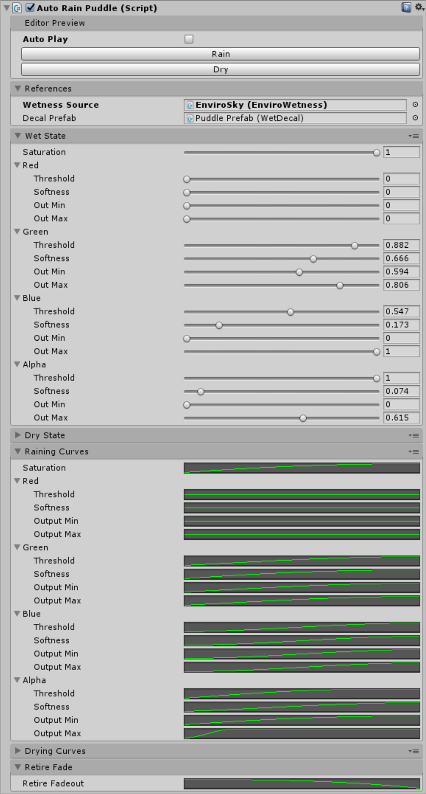

# Rain Puddle Reference

This component creates a puddle which realistically expands and contracts over time.

## Methods And Properties

### `float Rate { get; set; }`

This property sets the rate of change per second of the wetness level. `0` is completely dry and `1` is completely wet - set this property to `1 / T` where `T` is how many seconds you expect the puddle to take to be completely wet.

### `BeginRaining()`

Call this to begin the raining phase of the puddle. The puddle will grow at the rate defined by the `Rate` property.

### `BeginDrying()`

Call this to begin the drying phase of the puddle. The puddle will shrink at the rate defined by the `Rate` property.

## Inspector

### Editor Preview

#### Auto Play

When this box is checked the puddle will automatically animate from Wet to dry in an endless loop. **Only when selected and in edit mode**.

#### Rain

When this button is clicked the puddle will begin it's rain cycle, once it is fully wet the animation will end and it will remain fully wet. **Only when selected and in edit mode**.

#### Dry

When this button is clicked the puddle will begin it's drying cycle, once it is fully dry the animation will end and it will remain fully dry. **Only when selected and in edit mode**.

### References

This section contains references to other objects in the scene.

#### Wetness Source

A reference to a [Wetness Source](../BaseExternalWetnessSource) component.

#### Decal Prefab

A prefab which contains a `Wet Decal` component. Instances of this prefab will be created by the puddle component.

### Wet State/Dry State

These sections define the two "end points" of the puddle animation. The `Wet State` defines the state that the puddle is in when it has finished the animation and is completely wet. The `Dry State` defines the state that the puddle is in when it has finished the animation and is completely dry.

All the settings are the standard settings for a [Wet Decal](../WetDecal).

### Raining Curves/Drying Curves

These sections define the curves the puddle follows when animating between wet and dry. The `Raining Curves` define the curves used when getting wetter. The `Drying Curves` define the curves used when getting drier.

For every curve the X axis is the wetness (0 to 1) and the Y axis is between the dry state and the wet state.

### Retire Fadeout

When a new raining animation is begun (by calling `BeginRaining`) all the existing puddle instances controlled by this component are "retired", they will fade out over a period of time and a new puddle instance will play the new raining animation. The `Retire Fadeout` curves determines how the fadeout of retired puddles progresses over time.