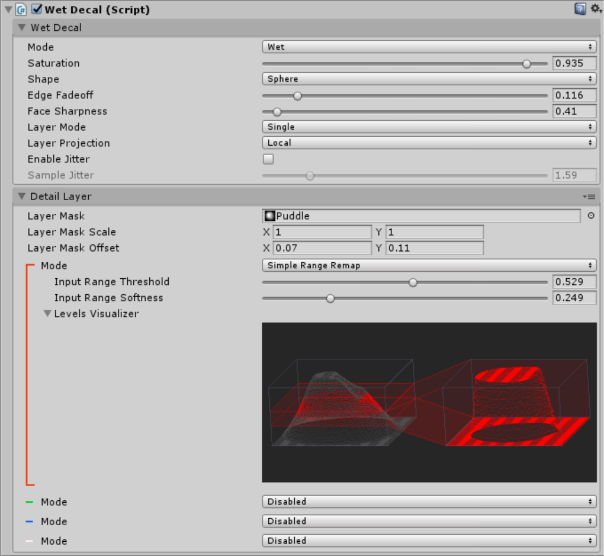
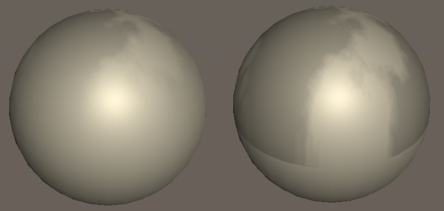

# Wet Decal Reference

## Inspector

The Wet Decal component is a powerful component with a lot of configuration options exposed in the inspector.

### Wet Decal

This section contains the core settings for the decal.

#### Saturation

Saturation represents the overall "wetness" of the decal. Values from 0 to ~0.8 represent water building up within the surface, providing the effect of the surface getting progressively more damp. Values from ~0.8 to 1 represent oversaturation - where a thin layer of water has built up over the surface to form a shallow puddle.

#### Shape & Edge Fadeoff

The decal can either be shaped as a cube or a sphere, this is selected using the `Shape` drop down. The effect fades off (reduces the saturation value) towards the edge of the decal volume, how rapidly it fades off is controlled by the `Edge Fadeoff` slider. A value of `0` will produce a hard cutoff and a value of `1` will fade off across the entire width of the decal.

#### Face Sharpness

Face sharpness controls how rapidly the effect fades off as the direction of the surface changes. Both of these spheres have a wetness effect being projected from above. The left sphere has a high face sharpness value, causing the effect to fade off as the surface direction is no longer facing upwards. The right sphere has a zero face sharpness value, causing the effect to be cut off as soon as the surface is facing away.

#### Layer Mode

This controls how many layers there are and how they are projected on surfaces. `None` mode has no detail layer and just projects untextured wetness down the Y axis. `Single` mode projects a single detail layer down the Y axis. `Triplanar` mode projects 3 different layers, one along each axis.

#### Layer Projection

The textures in layers can be layered onto the surfaces in two ways. `Local` mode will use the position of the decal as the position of the texture - when the decal is moved the texture will move with it. `World` mode will keep the texture still in the world - when the decal moves it will show a different slice of the texture. World mode can be used when you want to use several decals to select parts of a larger texture - the textures will automatically line up perfectly.

#### Sample Jitter

This setting adds dithering to all of the texture samples performed in the wet stuff shaders. Increasing dither will add noise but will reduce the effect of banding caused by low resolution textures used for large decals.

### Layers

Depending on the `Layer Mode` setting there will be 0, 1 or 3 detail layers - each decal layer projects a single texture in a single direction.

The values sampled from the layer mask texture control how the saturation changes per pixel. The maximum value from all 4 channels is used as the final saturation value.

#### Layer Mask

Sets the texture to use for this detail layer. A texture contains 4 channels (red, green, blue and alpha), Wet stuff allows you to set how to interpret each channel individually. Each channel is highlighted with the corresponding colour.

#### Layer Mask Scale / Offset

These settings allow you to change the size and position of the texture within the decal.

> This will likely cause visible artifacts if the texture does not tile correctly.

#### Mode

Sets how the channel is to be configured.

`Disabled` completely disables the channel, preventing it from having any effect on the output.

`Passthrough` directly passes through the values in the texture, a value of `0.5` in the pixel will correspond to `0.5 * Saturation` amount of wetness being applied.

`Simple Range Remap` allows you to change the threshold and softness values. These vary how much of the texture corresponds to a wet value and how softly the wetness fades out.

`Advanced Range Remap` has the same settings as simple range remap and also adds an output range sliders, this allows you to force the entire output to be wetter/drier.

#### Levels Visualizer

The levels visualizer shows a heightmap of the pixels in the channel on the left. On the right is a heightmap of the output you have configured. If a value is touching the top of the output it will produce `1.0 * Saturation` of the wetness effect. If a value is touching the bottom of the output it will be completely dry.

There is a comprehensive tutorial in how to use the levels visualizer [here](/Tutorials/LevelsVisualizer).