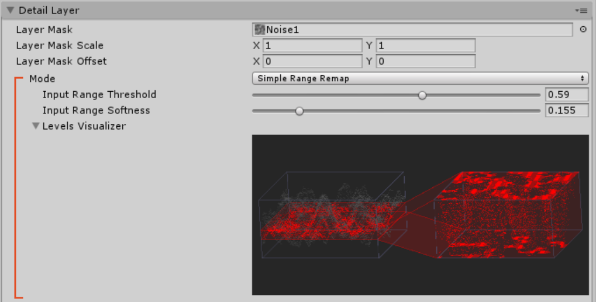
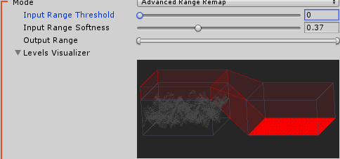
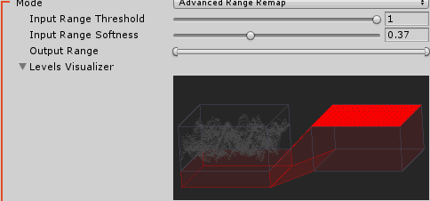
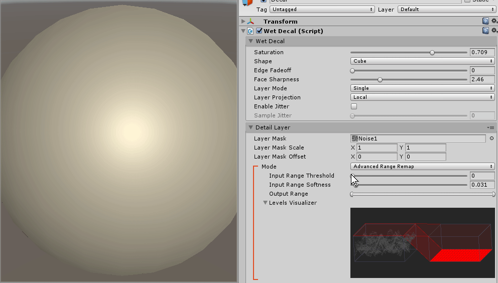
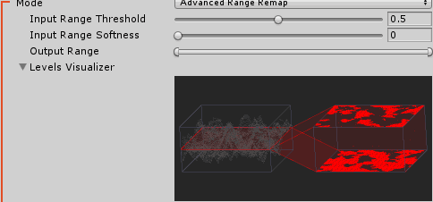
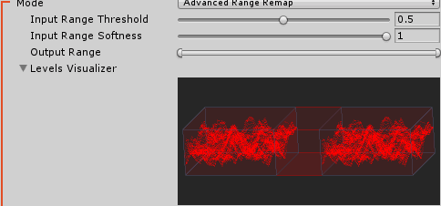
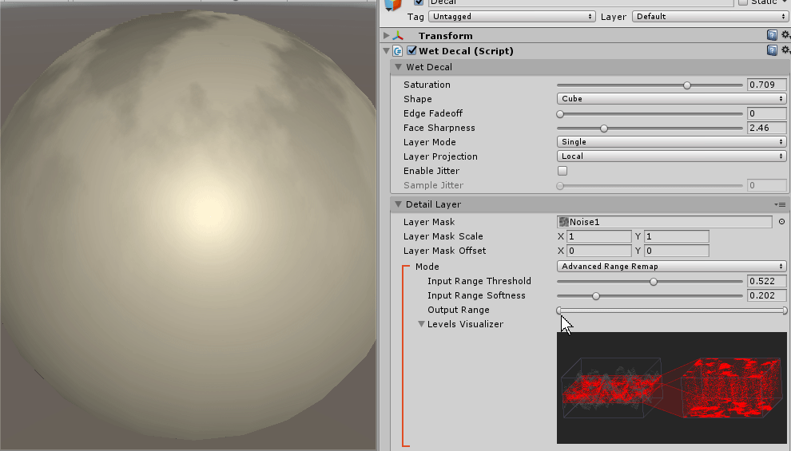

# Levels Visualizer

The levels visualizer is part of each colour channel in a detail layer.

On the left it shows a heightmap of the data values in the texture. On the right it shows how those values are being converted into wetness values. Values at the top of the right hand window indicate 100% wet. Values at the bottom of the right hand window represent completely dry.

## Input Range Threshold

Controls _which part_ of the input gets mapped into the output.

When the threshold is at zero all values in the input texture will result in a completely dry surface. This is shown by the output (on the right) being completely on the bottom:

When the threshold is at one all values in the input texture will results in a completely wet surface. This is shown by the output (in the left) being completely on the top:

Intermediate values will move the range and control how much of the texture is considered to be wet.

## Input Range Softness

Controls _how much_ of the input gets mapped into the output.

When the softness is `0` a single slice through the input texture will be taken. Values above the slice will be considered completely wet and values below the slice will be considered completely dry. This results in a very sharp transition from wet to dry at the edge of puddles.

When the softness is `1` the entire range of the input texture will be taken. Values at the top of the input range (or above) will be considered completely wet. Values at the bottom of the input range (or below) will be considered completely dry.

## Output Range

Controls the maximum and minimum amount of wetness in the output range.

