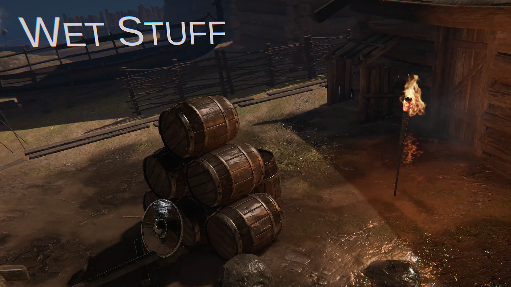

## Wet Stuff

Wet Stuff allows you to place deferred decals into the scene which project "wetness" onto surfaces within their volume. Define complex layered and animated decals to simulate rain, puddles, damp, leaking pipes, and more - without making any modifications to any of your assets or replacing shaders. This allows you to dramatically change the atmosphere of your scene in seconds with editor placed decals, or to generate decals dynamically by attaching them to particle collision points.

Available on the [Unity Asset Store](https://assetstore.unity.com/packages/tools/particles-effects/wet-stuff-118969?aid=1100lJDF).

If you're considering purchasing Wet Stuff but you're concerned if it will work with your game have a look at [this guide](/GettingStarted/Compatibility) to determine what will and will not work.

### Getting Started

Follow this [**Quick Start Guide**](GettingStarted/QuickStart) to get your first basic puddle rendering in a scene.

Read this [**Wet Decal**](GettingStarted/WetDecal) guide to learn all about how to use the basic `Wet Decal` component.

Read this [**Particle Wet Splatter**](GettingStarted/WetParticleSplatter) guide to learn all about how to use the `Particle Wet Splatter` component.

### Advanced Topics

If you want to do something unusual with _Wet Stuff_ the advanced documentation is the place to start. However we can't possibly cover every use case so make sure to [ask on the community](https://www.reddit.com/r/WetStuff/) or [raise an issue](https://github.com/Placeholder-Software/WetSurfaceDecals) if what you want to do isn't covered.

### Reference Documentation

Documentation for specific classes and component in the asset, explaining their specific purpose.